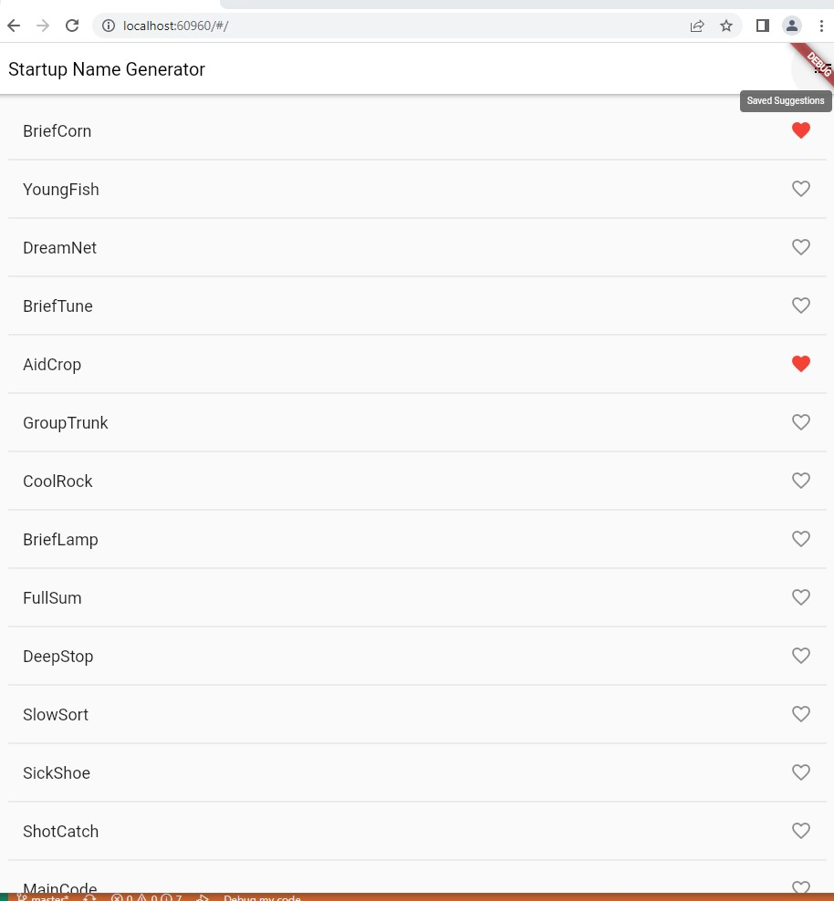
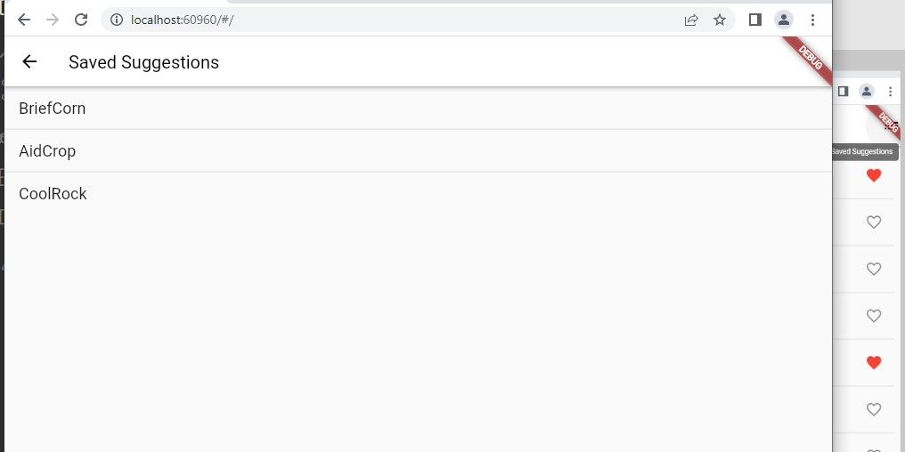

# my_app

A new Flutter project.

## Getting Started

### Here you can see the tutorial followed.
https://codelabs.developers.google.com/codelabs/first-flutter-app-pt2#0

## Integrants:
### Josue Singaña
### Erick Andrade
### Jhosef Rea
### Christina Soledispa
A few resources to get you started if this is your first Flutter project:

- [Lab: Write your first Flutter app](https://docs.flutter.dev/get-started/codelab)
- [Cookbook: Useful Flutter samples](https://docs.flutter.dev/cookbook)

For help getting started with Flutter development, view the
[online documentation](https://docs.flutter.dev/), which offers tutorials,
samples, guidance on mobile development, and a full API reference.
